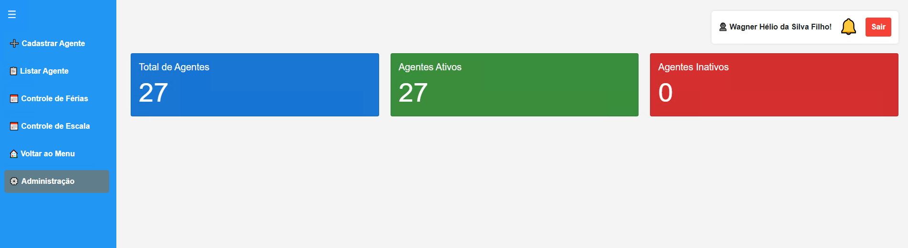
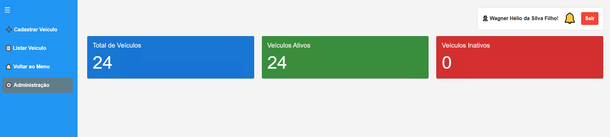

# 📋 Manual do Usuário - FrotaFácil

## Sistema de Gestão de Frota da Justiça Federal de Goiás

---

## 🎯 Índice

1. [Primeiros Passos](#primeiros-passos)
2. [Tela de Login](#tela-de-login)
3. [Menu Principal](#menu-principal)
4. [Gestão de Agentes](#gestão-de-agentes)
5. [Gestão de Veículos](#gestão-de-veículos)
6. [Gestão de Requisições](#gestão-de-requisições)
7. [Administração](#administração)
8. [Dicas e Truques](#dicas-e-truques)

---

## 🚀 Primeiros Passos

### Como Acessar o Sistema

1. **Abra seu navegador** (Chrome, Firefox, Edge)
2. **Digite o endereço** do sistema no campo de URL
3. **Aguarde** a tela de login aparecer
4. **Digite suas credenciais** (usuário e senha)
5. **Clique em "Entrar"**

> **💡 Dica:** Se for a primeira vez acessando, peça suas credenciais ao administrador do sistema.

---

## 🔐 Tela de Login

### Como Fazer Login

1. **Campo "Usuário":** Digite seu nome de usuário ou matrícula
2. **Campo "Senha":** Digite sua senha
3. **Botão "Entrar":** Clique para acessar o sistema

### Problemas Comuns

- **Esqueci minha senha:** Entre em contato com o administrador
- **Usuário não encontrado:** Verifique se digitou corretamente
- **Senha incorreta:** Verifique se a tecla Caps Lock está desligada

---

## 🏠 Menu Principal

Após fazer login, você verá o menu principal com 4 opções:

### 1. 👮 Gestão de Agentes
- Cadastrar, editar e gerenciar agentes
- Controle de férias e escalas
- Visualizar informações dos funcionários

### 2. 🚗 Gestão de Veículos
- Cadastrar e gerenciar veículos da frota
- Importar veículos em lote
- Visualizar status e disponibilidade

### 3. 📋 Gestão de Requisições
- Solicitar uso de veículos
- Aprovar ou rejeitar requisições
- Acompanhar status das solicitações

### 4. ⚙️ Administração
- Configurações avançadas do sistema
- Gerenciamento de usuários
- Relatórios e backups

---

## 👮 Gestão de Agentes

### Menu de Agentes

O sistema oferece as seguintes opções para gestão de agentes:

#### 📝 Cadastrar Agente

**Passo a Passo:**

1. **Clique em "Cadastrar Agente"**
2. **Preencha os campos obrigatórios:**
   - **Matrícula:** Digite a matrícula do agente
   - **Nome:** Nome completo do funcionário
   - **Email:** Email corporativo
3. **Campos opcionais:**
   - **Ativo:** Marque se o agente está ativo
   - **Início da Escala:** Data de início da escala de trabalho
   - **Início das Férias:** Data de início das férias
   - **Fim das Férias:** Data de término das férias
4. **Clique em "Salvar"**

**💡 Funcionalidade Especial - Busca por Matrícula:**
- Digite a matrícula no campo correspondente
- Clique no botão "🔍 Buscar"
- O sistema preencherá automaticamente nome e email

#### 📋 Listar Agente

**Como usar:**

1. **Clique em "Listar Agente"**
2. **Visualize todos os agentes cadastrados**
3. **Use os filtros para encontrar agentes específicos**
4. **Ações disponíveis:**
   - **👁️ Visualizar:** Ver detalhes do agente
   - **✏️ Editar:** Modificar informações
   - **🗑️ Excluir:** Remover agente (com confirmação)

#### 📅 Controle de Férias

**Funcionalidades:**

1. **Visualizar férias programadas**
2. **Cadastrar período de férias**
3. **Editar datas de férias**
4. **Excluir períodos de férias**

#### 📅 Controle de Escala

**Recursos disponíveis:**

1. **Definir escalas de trabalho**
2. **Visualizar escalas ativas**
3. **Gerenciar plantões**
4. **Acompanhar horários**

---

## 🚗 Gestão de Veículos

### Menu de Veículos

#### 📝 Cadastrar Veículo

**Campos do Formulário:**

**Informações Básicas:**
- **Localização do Tribunal:** Selecione o tribunal
- **Classificação do Grupo:** Tipo de veículo
- **Marca:** Fabricante do veículo
- **Modelo:** Modelo específico
- **Placa:** Placa do veículo
- **Ano de Fabricação:** Ano do veículo

**Especificações Técnicas:**
- **Potência (CV):** Potência do motor
- **Tipo de Combustível:** Gasolina, Diesel, Elétrico, etc.
- **Capacidade de Passageiros:** Número de lugares
- **Capacidade de Carga (kg):** Peso máximo de carga

**Informações de Controle:**
- **Quilometragem Atual:** KM atual do veículo
- **Status:** Ativo/Inativo
- **Observações:** Informações adicionais

**Como Cadastrar:**

1. **Clique em "Cadastrar Veículo"**
2. **Preencha todos os campos obrigatórios** (marcados com *)
3. **Verifique se as informações estão corretas**
4. **Clique em "Salvar"**

#### 📋 Listar Veículo

**Funcionalidades:**

1. **Visualizar todos os veículos**
2. **Filtrar por:**
   - Status (Ativo/Inativo)
   - Localização
   - Marca/Modelo
   - Disponibilidade
3. **Ações disponíveis:**
   - **👁️ Visualizar:** Ver detalhes completos
   - **✏️ Editar:** Modificar informações
   - **🗑️ Excluir:** Remover veículo
   - **📄 Gerar PDF:** Exportar lista

#### 📊 KPIs e Estatísticas

**Informações em Tempo Real:**
- Total de veículos
- Veículos disponíveis
- Veículos em uso
- Veículos em manutenção

---

## 📋 Gestão de Requisições

### Menu de Requisições

#### 📝 Cadastrar Requisição

**Passo a Passo:**

1. **Clique em "Cadastrar Requisição"**

2. **Preencha os dados da solicitação:**
   - **Unidade:** Selecione sua unidade
   - **Data de Utilização:** Quando precisa do veículo
   - **Previsão de Término:** Quando terminará o uso
   - **Itinerário:** Para onde vai
   - **Natureza do Serviço:** Motivo da viagem

3. **Selecione o veículo:**
   - O sistema mostra apenas veículos disponíveis
   - Veículos ocupados aparecem em cinza
   - Veja a previsão de término de veículos ocupados

4. **Clique em "Salvar"**

**⚠️ Validações Importantes:**
- A previsão de término não pode ser anterior à data de utilização
- Veículos ocupados não podem ser selecionados
- Todos os campos obrigatórios devem ser preenchidos

#### 📋 Listar Requisição

**Visualização de Requisições:**

1. **Veja todas as suas requisições**
2. **Filtros disponíveis:**
   - Status (Pendente, Aprovada, Rejeitada, Finalizada)
   - Data de utilização
   - Veículo solicitado
   - Unidade

3. **Ações por requisição:**
   - **👁️ Visualizar:** Ver detalhes completos
   - **✏️ Editar:** Modificar (se ainda não aprovada)
   - **✅ Aprovar:** (apenas para aprovadores)
   - **❌ Rejeitar:** (apenas para aprovadores)
   - **🏁 Finalizar:** Marcar como concluída

#### 🔄 Status das Requisições

**Tipos de Status:**

- **🟡 Pendente:** Aguardando aprovação
- **🟢 Aprovada:** Requisição aprovada
- **🔴 Rejeitada:** Requisição negada
- **🔵 Em Andamento:** Veículo em uso
- **⚫ Finalizada:** Requisição concluída

#### ✅ Aprovar Requisição

**Para Aprovadores:**

1. **Acesse a lista de requisições**
2. **Localize requisições pendentes**
3. **Clique em "Aprovar" ou "Rejeitar"**
4. **Adicione observações se necessário**
5. **Confirme a ação**

---

## ⚙️ Administração

### Acesso Administrativo

**Funcionalidades Disponíveis:**

1. **Gestão de Usuários:**
   - Criar novos usuários
   - Alterar permissões
   - Resetar senhas

2. **Configurações do Sistema:**
   - Configurar autenticação LDAP/Azure
   - Definir parâmetros do sistema
   - Backup de dados

3. **Relatórios:**
   - Relatórios de utilização
   - Estatísticas de frota
   - Relatórios de agentes

4. **Manutenção:**
   - Limpeza de dados antigos
   - Verificação de integridade
   - Logs do sistema

---

## 💡 Dicas e Truques

### Navegação Rápida

- **🏠 Voltar ao Menu:** Sempre disponível no menu lateral
- **⬅️ Botão Voltar:** Use para retornar à tela anterior
- **🔍 Busca:** Use os filtros para encontrar informações rapidamente

### Atalhos Úteis

- **F5:** Atualizar a página
- **Ctrl+F:** Buscar na página atual
- **Tab:** Navegar entre campos do formulário

### Boas Práticas

1. **Sempre verifique** as informações antes de salvar
2. **Use filtros** para encontrar dados específicos
3. **Mantenha os dados atualizados** regularmente
4. **Reporte problemas** ao administrador do sistema

### Problemas Comuns e Soluções

**❓ Não consigo acessar o sistema:**
- Verifique se digitou usuário e senha corretamente
- Confirme se sua conta está ativa
- Entre em contato com o administrador

**❓ Veículo não aparece na lista:**
- Verifique se o veículo está ativo
- Confirme se não está em manutenção
- Veja se não está ocupado no período solicitado

**❓ Requisição não foi aprovada:**
- Verifique se todos os campos foram preenchidos
- Confirme se as datas estão corretas
- Aguarde a aprovação do responsável

**❓ Erro ao salvar dados:**
- Verifique se todos os campos obrigatórios estão preenchidos
- Confirme se as datas estão no formato correto
- Tente novamente ou recarregue a página

---

## 📞 Suporte

### Contatos

- **Administrador do Sistema:** Entre em contato com o suporte técnico
- **Email:** wagner.helio@discente.ufg.br
- **Telefone:** Consulte a lista de contatos da JFGO

### Horário de Atendimento

- **Segunda a Sexta:** 8h às 18h
- **Feriados:** Não há atendimento

---

## 📝 Versão da Documentação

**Versão:** 1.0  
**Data:** Janeiro 2025  
**Sistema:** FrotaFácil v3.2.25

---

*Esta documentação foi criada para facilitar o uso do sistema FrotaFácil. Em caso de dúvidas, consulte o administrador do sistema.* 