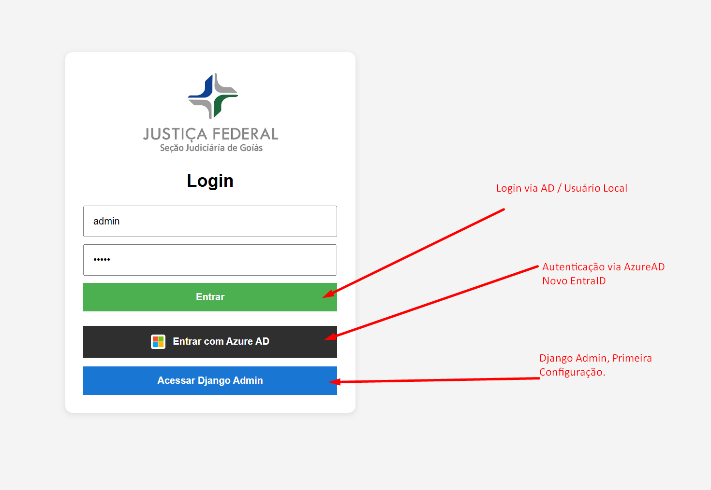
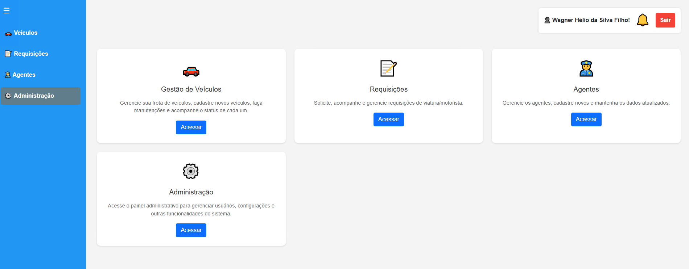
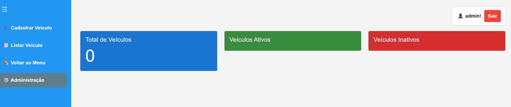
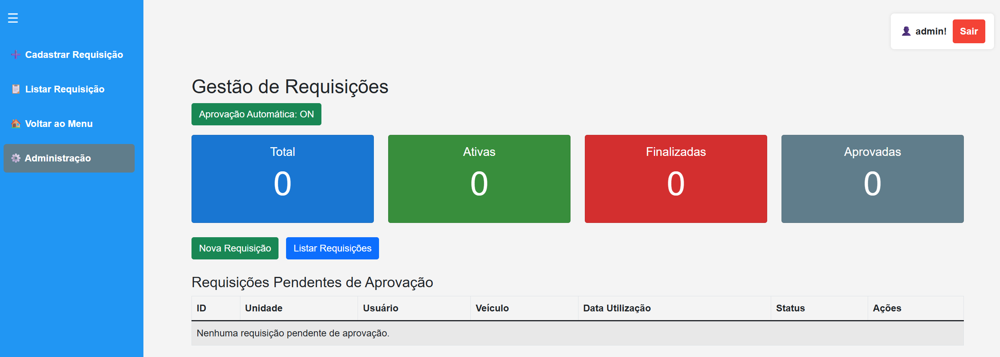
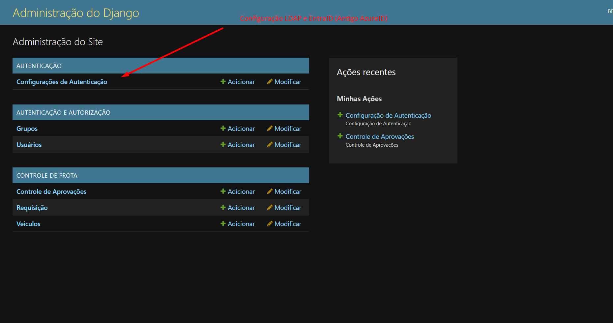

# FrotaFácil

Sistema moderno de gestão de frota desenvolvido em Django, com foco em padronização, responsividade, integração de dados e fluxo de requisições.

---

## 🖼️ Telas do Sistema

<table>
  <tr>
    <th>Login</th>
    <th>Home</th>
    <th>Home Veículos</th>
    <th>Home Requisições</th>
    <th>Home Agentes</th>
    <th>Home Admin</th>
  </tr>
  <tr>
    <td><a href="frotafacil/static/Docs/Login.png"></a></td>
    <td><a href="frotafacil/static/Docs/Home.png"></a></td>
    <td><a href="frotafacil/static/Docs/Home_Veiculos.png"></a></td>
    <td><a href="frotafacil/static/Docs/Home_Requisicoes.png"></a></td>
    <td><a href="frotafacil/static/Docs/Home_Agentes.png"></a></td>
    <td><a href="frotafacil/static/Docs/Home_Admin.png"></a></td>
  </tr>
</table>

## 🚀 Passo a Passo para Subir o Projeto

### 1. Crie e ative o ambiente virtual (recomendado: 'frotafacil-env')
```bash
# Windows
python -m venv frotafacil-env
Set-ExecutionPolicy -ExecutionPolicy RemoteSigned -Scope Process
.\frotafacil-env\Scripts\activate

# Linux/macOS
python3 -m venv frotafacil-env
source frotafacil-env/bin/activate
```

### 2. Clone o repositório pra dentro de frotafacil-env
```bash
cd frotafacil-env

git clone https://github.com/wagnerhelio/frotafacil.git
ou
git clone https://github.com/ViniciusBenevides/Projetos-JF.git

cd frotafacil
```

### 3. Instale as dependências
```bash
pip install -r requirements.txt

Caso tenha atualizado o projeto atualize os requirements

pip freeze > requirements.txt
```

### 5. Execute as migrações
```bash
python manage.py makemigrations
python manage.py migrate
```

### 6. Crie um superusuário
```bash
python manage.py createsuperuser
```

### 7. Inicie o servidor Local
```bash
python manage.py runserver
```
### 8. Inicie o servidor Linux 

### Ajustando permissões do banco de dados SQLite

Após subir o projeto no servidor Linux, ajuste as permissões do arquivo do banco de dados para evitar erros de "readonly database" ao rodar com Apache:

```bash
# Dê a posse do arquivo do banco para o usuário do Apache
chown www-data:www-data /var/www/html/sistemas/frotafacil-env/frotafacil/db.sqlite3

# Dê permissão de leitura e escrita para o usuário e grupo
chmod 664 /var/www/html/sistemas/frotafacil-env/frotafacil/db.sqlite3

# Dê permissão de escrita no diretório onde está o banco
chown www-data:www-data /var/www/html/sistemas/frotafacil-env/frotafacil/
chmod 775 /var/www/html/sistemas/frotafacil-env/frotafacil/
```

Se o Apache estiver rodando como outro usuário, substitua `www-data` pelo usuário correto.

### Reiniciando o Apache e monitorando logs

Após ajustar as permissões, reinicie o serviço do Apache para garantir que as alterações tenham efeito:

```bash
service apache2 restart
```

Se quiser limpar o log de erros antes de testar novamente:

```bash
truncate -s 0 /var/log/apache2/error.log
```

Para monitorar o log de erros em tempo real:

```bash
tail -f /var/log/apache2/error.log
```

## ⚙️ URLs de Acesso

- **Admin Django Local:**
  - URL: [http://127.0.0.1:8000/admin/](http://127.0.0.1:8000/admin/)
- **Admin Django Homolog Linux:**
  - URL: [http://172.22.3.95/frotafacil/admin](http://127.0.0.1:8000/admin/)

  > **Importante:** Após criar o superusuário, acesse a tela acima e insira os dados dos usuários de serviço LDAP e o Azure Tenant ID para autenticação corporativa.

---

## 🧰 Tecnologias Utilizadas

- Python 3.10+
- Django 5.2
- Bootstrap 5
- SQLite (desenvolvimento) / PostgreSQL (produção)
- Azure AD / LDAP para autenticação

## ✅ Requisitos

- Python 3.10+
- pip (gerenciador de pacotes Python)
- Git
- Navegador moderno (Chrome, Firefox, Edge)

---

## 🗂 Estrutura do Projeto

```
frotafacil/
├── auth_django/                # Módulo de autenticação de usuários
│   ├── admin.py                # Configurações do Django Admin para autenticação
│   ├── apps.py                 # Configuração da aplicação para o Django
│   ├── autenticar_usuario.py   # Lógica personalizada de autenticação
│   ├── migrations/             # Migrações do banco de dados (autenticação)
│   ├── models.py               # Modelos de dados de autenticação
│   ├── tests.py                # Testes automatizados de autenticação
│   ├── urls.py                 # Rotas/URLs de autenticação
│   └── views.py                # Views de autenticação
├── controlefrota/              # Aplicação principal de controle de frota
│   ├── __init__.py             # Inicialização do pacote
│   ├── admin.py                # Configurações do Django Admin para frota
│   ├── apps.py                 # Configuração da aplicação para o Django
│   ├── forms_agente.py         # Formulários para agentes
│   ├── forms_requisicao.py     # Formulários para requisições
│   ├── forms_veiculo.py        # Formulários para veículos
│   ├── importa_veiculos.py     # Script de importação de veículos
│   ├── migrations/             # Migrações do banco de dados (frota)
│   ├── models_agente.py        # Modelos de dados de agentes
│   ├── models_ferias.py        # Modelos de dados de férias de agentes
│   ├── models_requisicao.py    # Modelos de dados de requisições
│   ├── models_veiculo.py       # Modelos de dados de veículos
│   ├── models.py               # Modelos centralizados ou importações
│   ├── templates/              # Templates HTML da aplicação de frota
│   ├── templatetags/           # Tags customizadas para templates
│   ├── tests.py                # Testes automatizados da aplicação de frota
│   ├── urls.py                 # Rotas/URLs da aplicação de frota
│   ├── views_agente.py         # Views para agentes
│   ├── views_requisicao.py     # Views para requisições
│   └── views_veiculo.py        # Views para veículos
├── frotafacil/                 # Configurações globais do projeto Django
│   ├── asgi.py                 # Configuração para ASGI
│   ├── settings.py             # Configurações principais do projeto
│   ├── templates/              # Templates HTML globais (login, home)
│   ├── urls.py                 # Rotas/URLs globais
│   └── wsgi.py                 # Configuração para WSGI
├── static/                     # Arquivos estáticos (CSS, JS, imagens)
│   ├── admin/                  # Arquivos estáticos do admin do Django
│   ├── Docs/                   # Imagens de documentação do sistema
│   ├── img/                    # Imagens do sistema
│   └── ...                     # Outros arquivos estáticos (planilhas, etc)
├── manage.py                   # Script principal de gerenciamento Django
```

## 📱 Funcionalidades Principais

### Autenticação
- Login local
- LDAP
- Azure AD
- Controle de permissões

### Gestão de Veículos
- Cadastro completo com informações detalhadas
- Importação em massa via Excel
- Filtros avançados de busca
- KPIs em tempo real

### Requisições
- Fluxo completo de requisição
- Aprovação automática configurável
- Validações de disponibilidade
- Controle de quilometragem

---

## 📝 Licença

Este projeto está sob a licença MIT. Veja o arquivo [LICENSE](LICENSE) para mais detalhes.

## 📬 Contato

Wagner Hélio - wagner.helio@discente.ufg.br